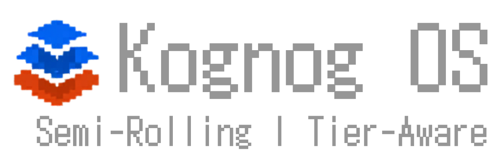

<p align="center">
  
</p>

<p align="center">
  
  
  
  
  
  
  
</p>

---

## What is KognogOS?

KognogOS is an **Arch-based, semi-rolling, tier-aware Linux distribution**. It's built on one simple idea: **not all updates are equal**.

Most rolling-release distributions treat every package the same — when an update is available, it gets installed. Your kernel and core system libraries update automatically alongside a trivial icon theme. One bad kernel sync and your machine doesn't boot.

KognogOS solves this with a **three-tier update model** enforced by [`nog`](https://github.com/jetomev/nog), its tier-aware package manager. Tier 1 packages — kernel, bootloader, glibc, systemd, mesa — are held for 30 days after upstream publish, giving the community time to catch regressions. Tier 2 — desktop environment and key applications — are held for 15 days. Tier 3 — everything else — flows through in 7.

The result feels like a rolling release for most of your software, but behaves like a stable distribution for the parts that actually matter.

KognogOS ships with a curated in-house **Forge suite** — TUI tools for package management, bootloader configuration, and terminal customization — and is available in **five editions** matched to how you actually use a Linux machine: Basic, Office, Gaming, Development, and Full.

---

## Philosophy

- **Stability where it counts** — kernel, bootloader, and core libraries get a 30-day community buffer before they land on your machine
- **Freshness everywhere else** — Tier 3 packages stay current without ceremony
- **Safety by default** — `nog` invokes pacman as a subprocess; every transaction goes through pacman's own signature verification
- **Beautiful by design** — KDE Plasma on Wayland, Catppuccin Mocha throughout, one opinionated terminal stack
- **Transparent tooling** — the Forge suite is readable source code, no magic
- **Built to grow** — the architecture is designed to eventually support a fully independent repo and build pipeline

---

## Editions

KognogOS ships as five editions, all sharing the same core (KDE Plasma, nog-managed updates, the Forge suite, drivers, default terminal stack) and differing only in the app stack layered on top. Edition definitions live in [`config/profiles.toml`](config/profiles.toml) — the single source of truth the Calamares installer will read.

### Basic
The shared core. Boots straight into a KDE Plasma Wayland desktop with the KognogOS terminal welcome box, **Fresh Editor** as the default text editor, both **Google Chrome** and **Brave** ready to go, and `nog` + `grubforge` + `alacrittyforge` installed out of the box.

### Office
Basic + **OnlyOffice**, **Obsidian**, **Thunderbird**, **Xournalpp**, **Elisa**, **Spotify**, **GIMP**, **Pinta**, **Discord**, **Telegram**, plus a full CUPS printing and scanning stack.

### Gaming
Basic + **Steam**, **Lutris**, **Heroic**, **Wine**, **Proton-GE**, **RetroArch**, 32-bit graphics, **Gamescope**, **GameMode**, **MangoHud**, and **OBS Studio** for streaming.

### Development
Basic + **VS Code**, **Neovim**, **rustup**, **Node.js**, **Docker**, **Tmux**, a modern CLI toolkit (bat, eza, fd, ripgrep, fzf, zoxide), build tools (cmake, meson, ninja), and debuggers (gdb, lldb).

### Full
Basic + Office + Gaming + Development — everything KognogOS ships.

---

## The Three-Tier Update System

Every package on the system belongs to one of three tiers, enforced by `nog`:

### Tier 1 — 30-Day Hold
The most critical packages on your system — kernel, bootloader, glibc, systemd, mesa. Updates are held for **30 days** after upstream publish. Once the hold expires, the update flows through `nog update` like any other package. **Expert mode:** set `manual_signoff = true` in `/etc/nog/tier-pins.toml` to require explicit `nog unlock <pkg> --promote` for every Tier 1 upgrade.

### Tier 2 — 15-Day Hold
Desktop environment and key applications — Plasma, SDDM, PipeWire, NetworkManager, the Forge suite, and more. Held for **15 days**.

### Tier 3 — 7-Day Hold
Everything else. A short **7-day** safety buffer, then updates flow through automatically.

For full details, see [the `nog` documentation](https://github.com/jetomev/nog#the-three-tier-system).

---

## The Forge Suite

KognogOS ships with an in-house suite of TUI tools that replace the "edit a config file and pray" workflow with safe, guided interfaces for common system tasks. All Forge tools are pinned to Tier 2.

### nog — Package manager
Tier-aware pacman wrapper in Rust. Classifies every package, enforces hold windows via pacman's own `--ignore` mechanism, and delegates to `yay`/`paru` for AUR. Runs as your user; escalates only to `sudo pacman` when necessary.
→ **v1.0.2 stable** · [github.com/jetomev/nog](https://github.com/jetomev/nog) · `yay -S nog`

### grubforge — Bootloader manager
Full TUI for managing GRUB: safely edit `/etc/default/grub`, browse and apply themes, reorder boot entries, detect other operating systems, with timestamped backups before every change.
→ **Shipping** · [github.com/jetomev/grubforge](https://github.com/jetomev/grubforge) · `yay -S grubforge`

### alacrittyforge — Terminal configurator
TUI for managing Alacritty's TOML config — font, colors, opacity, keybindings — with live previews and reversible edits.
→ **Shipping** · [github.com/jetomev/alacrittyforge](https://github.com/jetomev/alacrittyforge)

### nogforge — Unified package TUI *(coming soon)*
A TUI companion for `nog` plus a unified interface across AUR helpers, Flatpak, and Snap. In active development.
→ **Upcoming** · [github.com/jetomev/nogforge](https://github.com/jetomev/nogforge)

---

## Tech Stack

| Component | Choice |
|-----------|--------|
| Base | Arch Linux |
| Kernel | Linux (mainline) + Linux-LTS fallback |
| Microcode | Auto-detected at install time (intel-ucode / amd-ucode) |
| Desktop | KDE Plasma on Wayland |
| Display Manager | SDDM |
| Audio | PipeWire + WirePlumber |
| Network | NetworkManager |
| GPU drivers | Mesa + Vulkan (AMD / Intel) · Nvidia-Open DKMS |
| Package Manager | pacman + **nog** |
| Bootloader Manager | **grubforge** |
| Terminal | **Alacritty** + AlacrittyForge-driven config |
| Shell | **Fish** + Tide v6 prompt |
| Default Editor | **Fresh Editor** |
| Default Browsers | Google Chrome + Brave (both shipped) |
| Font | JetBrains Mono Nerd Font |
| Theme | Catppuccin Mocha |
| Extra Repos | chaotic-aur |

---

## Project Structure

```
KognogOS/
|-- assets/
|   |-- wallpapers/                # 10 wallpapers across Arch + Semi variants
|-- bootstrap/                     # Future: installer bootstrap scripts
|-- config/
|   |-- pacman.conf                # Shipped pacman.conf (core/extra/multilib/chaotic-aur)
|   |-- profiles.toml              # Edition definitions (Basic/Office/Gaming/Development/Full)
|   |-- dependencies.toml          # Legacy package manifest (being migrated into profiles.toml)
|   |-- tier-pins.toml             # Tier 1/2 package assignments shipped as distro default
|   |-- nog.conf                   # Shipped /etc/nog/nog.conf
|   |-- alacritty.toml             # Default Alacritty terminal config
|   |-- config.fish                # Default Fish shell config
|   |-- tide_config.fish           # Default Tide v6 prompt configuration
|   |-- fish_greeting.fish         # Terminal welcome-box trigger
|   |-- sysinfo.py                 # Terminal welcome-box script
|-- docs/                          # Future: documentation
|-- installer/                     # Future: Calamares configuration
|-- logo/                          # KognogOS logo (transparent, light, dark)
|-- repo/                          # Future: custom package repository
|-- LICENSE
|-- README.md
```

---

## Current State

KognogOS is in **active early development**. The package manager (`nog`) and two of the four Forge tools (`grubforge`, `alacrittyforge`) are shipping to the AUR. The edition model is defined in `config/profiles.toml`. The installer, custom repository, and ISO pipeline are next.

**What's solid today:**
- `nog` v1.0.2 stable on AUR — tier-aware updates, AUR integration, documented privilege model, full dogfood pass
- `grubforge` shipping on AUR — full TUI for GRUB management
- `alacrittyforge` shipping — terminal configurator
- Five-edition product surface formalized in `config/profiles.toml`
- Default terminal stack: Alacritty + Fish + Tide v6 + KognogOS welcome box
- Full `pacman.conf` shipped with chaotic-aur enabled
- Wallpaper set: ten wallpapers across Arch + Semi variants

---

## Roadmap

- [x] Product surface formalized — five editions in `config/profiles.toml`
- [x] `nog` extracted to its own stable repo + AUR package
- [x] `pacman.conf` with chaotic-aur shipped as distro default
- [x] Default terminal stack (Alacritty + Fish + Tide v6 + welcome box)
- [ ] **KDE Plasma config export** — capture the active Plasma configuration (panels, widgets, shortcuts, theme) into `/etc/skel/` as the distro default
- [ ] **Calamares installer** — five edition radio buttons; auto-detect CPU microcode + GPU generation; reads `config/profiles.toml` as source of truth
- [ ] **ISO build pipeline** — archiso-based; unified installer ISO with edition selection
- [ ] **`nogforge`** — finish the TUI companion for nog
- [ ] **Custom package repository** — `repo.kognog.org` with staging / testing / stable channels
- [ ] **First public ISO release**

---

## Changelog

### v0.8.1-alpha — 2026-04-20
**nog spun out; KognogOS repositioned around external nog + in-house Forge suite**

Clean repositioning release. No new distro-level capability ships, but every piece of repo drift since v0.8.0-alpha is resolved and the product surface is redefined around the new reality: `nog` is now a standalone stable project, and KognogOS is the distro that ships it by default alongside a curated Forge suite.

**Repository cleanup:**
- 🗑 Removed the vestigial `nog/` subtree — nog now lives at [github.com/jetomev/nog](https://github.com/jetomev/nog) and ships as an external AUR package
- 🗑 Removed empty `docs/DESIGN.md` and `docs/TIERS.md` stubs
- 🖼 Wallpaper set expanded: the old three-variant set was replaced by two five-variant sets ("Kognog OS Arch" + "Kognog OS Semi"), ten wallpapers total; new default is **Semi Catppuccin Mocha**

**New configuration surface:**
- 📋 `config/profiles.toml` — canonical edition-definition file with five editions (Basic, Office, Gaming, Development, Full). Calamares will read this at install time.
- 📦 `config/pacman.conf` — was a 0-byte placeholder; now ships with `core` / `extra` / `multilib` / `chaotic-aur` enabled, plus the distro's pacman tweaks (`Color`, `VerbosePkgLists`, `ILoveCandy`, `ParallelDownloads=5`)
- 🎚 `config/tier-pins.toml` — firefox removed from Tier 2; browsers default to Tier 3

**Positioning:**
- 📖 README rewritten top-to-bottom around the new product surface
- 🌳 Tier model description updated to match nog v1.0 (30 / 15 / 7 days, not the old 10 / 3)
- 🧩 The Forge suite replaces the old per-tool README sections — one coherent story for `nog` + `grubforge` + `alacrittyforge` + upcoming `nogforge`
- 🎨 Editions section added — the product surface made explicit for the first time

### v0.8.0-alpha — 2026-04-07
**Default terminal stack**
- Alacritty config with Catppuccin Mocha, JetBrains Mono Nerd Font, 150x50 window
- Fish shell config with cargo path
- `fish_greeting.fish` triggers `sysinfo.py` on every new terminal session
- `tide_config.fish` applies the KognogOS default Tide v6 prompt
- `alacritty`, `fish`, `alacrittyforge` pinned to Tier 2
- `ttf-jetbrains-mono-nerd` and `alacrittyforge` added to dependencies

### v0.7.1-alpha — 2026-04-07
**nog AUR package + man page** *(work subsequently migrated to the standalone nog repo)*
- `nog` available on the AUR
- Man page added
- Version reads from `CARGO_PKG_VERSION`

### v0.6.0-alpha — 2026-04-05
**Terminal welcome box**
- KognogOS-branded terminal welcome box on every new session
- Live weather (Open-Meteo), live tier notifications (red for Tier 1 sign-off, green for Tier 2 ready)
- Built with Python + Rich, Catppuccin Mocha throughout

### v0.5.0-alpha — 2026-04-05
**nog pin persistence** *(work migrated to the standalone nog repo)*

### v0.4.0-alpha — 2026-04-05
**nog update — Tier 1 exclusion** *(work migrated to the standalone nog repo)*

### v0.3.0-alpha — 2026-04-04
**nog search + system install + GrubForge included + KognogOS logo**

### v0.2.0-alpha — 2026-03-25
**Tier system + real pacman calls** *(work migrated to the standalone nog repo)*

### v0.1.0-alpha — 2026-03-25
**Initial release — nog CLI skeleton** *(work migrated to the standalone nog repo)*

---

## Related Projects

The KognogOS ecosystem lives across several repositories. All are developed by the same team.

- **[nog](https://github.com/jetomev/nog)** — tier-aware package manager, the engine that makes KognogOS semi-rolling. Stable on the AUR.
- **[grubforge](https://github.com/jetomev/grubforge)** — GRUB bootloader manager. Stable on the AUR.
- **[alacrittyforge](https://github.com/jetomev/alacrittyforge)** — Alacritty terminal configurator. Shipping.
- **[nogforge](https://github.com/jetomev/nogforge)** — unified TUI for nog / AUR helpers / Flatpak / Snap. In development.

---

## Authors

**jetomev** — idea, vision, direction, testing

**Claude (Anthropic)** — co-developer, architecture, implementation

KognogOS is a collaboration between a human with a clear vision for what a Linux distro should feel like, and an AI that helped design and build the pieces — one `config/profiles.toml` entry at a time.

---

## License

KognogOS is free software: you can redistribute it and/or modify it under the terms of the **GNU General Public License v3.0** as published by the Free Software Foundation.

See [LICENSE](LICENSE) for the full license text.

---

## Contributing

KognogOS is in early alpha. Ideas, feedback, and contributions are welcome — open an issue or pull request on GitHub.

If this project resonates with you, consider starring the repository. It helps others find it and motivates continued development.
