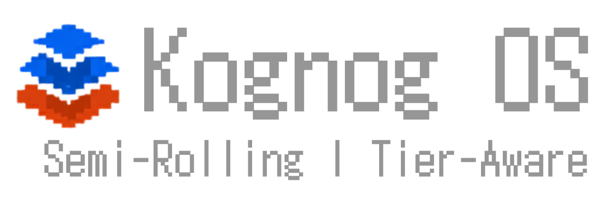

<p align="center">
  
</p>

<p align="center">
  
  
  
  
  
  
  

> 🛡 **Security:** every release is GPG-signed and every commit GitHub-Verified. Read **[Where We Stand](https://github.com/jetomev/KognogOS/blob/main/docs/where-we-stand.md)** — our response to the 2026 AUR supply-chain attacks, what is current, and how to verify us instead of trusting us.
</p>

---

## What is KognogOS?

KognogOS is an **Arch-based, semi-rolling, tier-aware Linux distribution**. It's built on one simple idea: **not all updates are equal**.

Most rolling-release distributions treat every package the same — when an update is available, it gets installed. Your kernel and core system libraries update automatically alongside a trivial icon theme. One bad kernel sync and your machine doesn't boot.

KognogOS solves this with a **three-tier update model** enforced by [`nog`](https://github.com/jetomev/nog), its tier-aware package manager. Tier 1 packages — kernel, bootloader, glibc, systemd, mesa — are held for 30 days after upstream publish, giving the community time to catch regressions. Tier 2 — desktop environment and key applications — are held for 15 days. Tier 3 — everything else — flows through in 7.

The result feels like a rolling release for most of your software, but behaves like a stable distribution for the parts that actually matter.

KognogOS ships with a curated in-house **Forge suite** — TUI tools for package management, bootloader configuration, and terminal customization — and is available in **five editions** matched to how you actually use a Linux machine: Basic, Office, Gaming, Development, and Full.

---

## Philosophy

- **Stability where it counts** — kernel, bootloader, and core libraries get a 30-day community buffer before they land on your machine
- **Freshness everywhere else** — Tier 3 packages stay current without ceremony
- **Safety by default** — `nog` invokes pacman as a subprocess; every transaction goes through pacman's own signature verification
- **Beautiful by design** — KDE Plasma on Wayland, Catppuccin Mocha throughout, one opinionated terminal stack
- **Transparent tooling** — the Forge suite is readable source code, no magic
- **TUI-first culture (locked 2026-07-31)** — every KognogOS system tool is a Forge-suite terminal app built on [forgekit](https://github.com/jetomev/forgekit): the welcome center, the installer, the managers. One design language from first boot to daily driving, converging toward a full **Forge Control Center**. The pixel-art emblem renders natively in the medium
- **Built to grow** — the architecture is designed to eventually support a fully independent repo and build pipeline

---

## Editions

KognogOS ships as five editions, all sharing the same core (KDE Plasma, nog-managed updates, the Forge suite, drivers, default terminal stack) and differing only in the app stack layered on top. Edition definitions live in [`config/profiles.toml`](config/profiles.toml) — the single source of truth `installforge` reads at install time.

### Basic
The shared core. Boots straight into a KDE Plasma Wayland desktop with the KognogOS terminal welcome box, **Nemo** as the default file manager (Dolphin stays installed), **Fresh Editor** as the default text editor, both **Google Chrome** and **Brave** ready to go, and `nog` + `grubforge` + `alacrittyforge` installed out of the box. Daily-life floor included: Gwenview, Ark, KCalc, Spectacle, full font coverage (Noto + emoji + Liberation), printing and scanning (CUPS + Skanlite), and **ufw enabled by default** (deny incoming).

### Office
Basic + **OnlyOffice**, **Obsidian**, **Thunderbird**, **Xournalpp**, **Elisa**, **Spotify**, **GIMP**, **Pinta**, **Kdenlive**, **Discord**, **Telegram**.

### Gaming
Basic + **Steam**, **Lutris**, **Heroic**, **Wine**, **Proton-GE**, **RetroArch with a starter core set** (NES/SNES/Genesis/PS1/N64/GBA), 32-bit graphics, **Gamescope**, **GameMode**, **MangoHud**, and **OBS Studio** for streaming.

### Development
Basic + **VS Code**, **Neovim**, **rustup**, **Node.js**, **Go**, **OpenJDK**, **Docker**, **Tmux**, a modern CLI toolkit (bat, eza, fd, ripgrep, fzf, zoxide), build tools (cmake, meson, ninja), and both compiler families with their debuggers (gcc/gdb, clang/lldb).

### Full
Basic + Office + Gaming + Development — everything KognogOS ships.

---

## The Three-Tier Update System

Every package on the system belongs to one of three tiers, enforced by `nog`:

### Tier 1 — 30-Day Hold
The most critical packages on your system — kernel, bootloader, glibc, systemd, mesa. Updates are held for **30 days** after upstream publish. Once the hold expires, the update flows through `nog update` like any other package. **Expert mode:** set `manual_signoff = true` in `/etc/nog/tier-pins.toml` to require explicit `nog unlock <pkg> --promote` for every Tier 1 upgrade.

### Tier 2 — 15-Day Hold
Desktop environment and key applications — Plasma, SDDM, PipeWire, NetworkManager, the Forge suite, and more. Held for **15 days**.

### Tier 3 — 7-Day Hold
Everything else. A short **7-day** safety buffer, then updates flow through automatically.

For full details, see [the `nog` documentation](https://github.com/jetomev/nog#the-three-tier-system).

---

## The Forge Suite

KognogOS ships with an in-house suite of TUI tools that replace the "edit a config file and pray" workflow with safe, guided interfaces for common system tasks. All Forge tools are pinned to Tier 2.

### nog — Package manager
Tier-aware pacman wrapper in Rust. Classifies every package, enforces hold windows via pacman's own `--ignore` mechanism, and delegates to `yay`/`paru` for AUR. Runs as your user; escalates only to `sudo pacman` when necessary.
→ **v1.0.8 stable** · [github.com/jetomev/nog](https://github.com/jetomev/nog) · `yay -S nog`

### grubforge — Bootloader manager
Full TUI for managing GRUB: safely edit `/etc/default/grub`, browse and apply themes, reorder boot entries, detect other operating systems, with timestamped backups before every change.
→ **Shipping** · [github.com/jetomev/grubforge](https://github.com/jetomev/grubforge) · `yay -S grubforge`

### alacrittyforge — Terminal configurator
TUI for managing Alacritty's TOML config — font, colors, opacity, keybindings — with live previews and reversible edits.
→ **Shipping** · [github.com/jetomev/alacrittyforge](https://github.com/jetomev/alacrittyforge)

### nogforge — Unified package TUI *(coming soon)*
A TUI companion for `nog` plus a unified interface across AUR helpers, Flatpak, and Snap. In active development.
→ **Upcoming** · [github.com/jetomev/nogforge](https://github.com/jetomev/nogforge)

---

## Tech Stack

| Component | Choice |
|-----------|--------|
| Base | Arch Linux |
| Kernel | Linux (mainline) + Linux-LTS fallback |
| Microcode | Auto-detected at install time (intel-ucode / amd-ucode) |
| Desktop | KDE Plasma on Wayland |
| File Manager | **Nemo** (default) · Dolphin (installed) |
| Display Manager | SDDM |
| Audio | PipeWire + WirePlumber |
| Network | NetworkManager |
| GPU drivers | Mesa + Vulkan (AMD / Intel) · Nvidia-Open DKMS |
| Package Manager | pacman + **nog** |
| Bootloader Manager | **grubforge** |
| Terminal | **Alacritty** + AlacrittyForge-driven config |
| Shell | **Fish** + Tide v6 prompt |
| Default Editor | **Fresh Editor** |
| Default Browsers | Google Chrome + Brave (both shipped) |
| Font | JetBrains Mono Nerd Font |
| Theme | Catppuccin Mocha |
| Extra Repos | chaotic-aur |
| System touches | Javier's `/etc/nanorc` + `pacman.conf` shipped as defaults · sudo `pwfeedback` (asterisks while typing) |

### Proprietary apps & their offered swaps

installforge marks every proprietary app in the edition lists; de-selecting one offers a curated replacement (defined in `config/profiles.toml [proprietary]`):

| Proprietary | Offered swaps |
|---|---|
| Google Chrome | Brave (already shipped) · Firefox |
| Spotify | Elisa (already in Office) · Strawberry |
| Discord | Vesktop (FOSS client, same service) · Element (Matrix) |
| Steam | — no equivalent; Lutris + Heroic remain |
| VS Code (MS build) | VSCodium · `code` (OSS build) |
| Obsidian | Logseq · Joplin |

---

## Project Structure

```
KognogOS/
|-- assets/
|   |-- wallpapers/                # 10 wallpapers across Arch + Semi variants
|-- config/
|   |-- pacman.conf                # Shipped pacman.conf (core/extra/multilib/chaotic-aur)
|   |-- profiles.toml              # Edition definitions (Basic/Office/Gaming/Development/Full)
|   |-- dependencies.toml          # Legacy package manifest (being migrated into profiles.toml)
|   |-- tier-pins.toml             # Tier 1/2 package assignments shipped as distro default
|   |-- nog.conf                   # Shipped /etc/nog/nog.conf
|   |-- alacritty.toml             # Default Alacritty terminal config
|   |-- config.fish                # Default Fish shell config
|   |-- tide_config.fish           # Default Tide v6 prompt configuration
|   |-- fish_greeting.fish         # Terminal welcome-box trigger
|   |-- sysinfo.py                 # Terminal welcome-box script
|-- docs/                          # Future: documentation
|-- installer/                     # Future: Calamares configuration
|-- logo/                          # KognogOS logo (transparent, light, dark)
|-- repo/                          # Future: custom package repository
|-- LICENSE
|-- README.md
```

---

## Current State

KognogOS is in **active early development**, on the road to a **v1.0 public ISO targeted for April 2027** — the project's origin week, two years after the wish that started it ("create an installer of my arch linux setup", 2025-04-19).

**What's solid today:**
- `nog` v1.0.8 stable on AUR — tier-aware updates, AUR integration, lib32/base hold coupling, tabled update reports, CSV run logging, documented privilege model, dogfooded on every release
- The Forge suite shipping on AUR — `grubforge` (GRUB TUI), `alacrittyforge` (terminal configurator), `bitlaforge` (solo-mining TUI), with `forgekit` as the shared v2 UI library
- Five-edition product surface formalized in `config/profiles.toml`
- Default terminal stack: Alacritty + Fish + Tide v6 + the KognogOS greeting (emblem, system table, and a tier-aware update status backed by a systemd user timer)
- Boot-to-prompt identity: GRUB theme, Plymouth, Plasma splash, SDDM greeter and shell greeting all drawn from the same emblem and palette
- Full `pacman.conf` shipped as distro default — **chaotic-aur enabled from the start** (decided 2026-07-30): its packages are governed by the tier system like every other repo, with **63 pre-assigned Tier 1 pins** (kernels, mesa/nvidia builds, `glibc-eac`, `pacman-git`, ZFS modules, boot-entry writers) generated by `scripts/chaotic-tier-audit.py` and refreshed each annual release. Everything else in chaotic rides Tier 3's automatic 7-day hold. (Honest scope note: tiers guard against *regressions*; repo-integrity failures remain the job of pacman's signature verification.)
- Wallpaper set: ten wallpapers across Arch + Semi variants

**First release scope (decided 2026-07-30):** KognogOS **Semi** only — the tier-aware semi-rolling flagship — with all five editions selectable at install time. The "Arch" brand variant is reserved for a future year. The installer will be **`installforge`**, a Forge-style TUI (own repo + AUR package, like its siblings) that reads `config/profiles.toml`, and installs **online** (decided 2026-07-30): all packages come from the mirrors at install time, so the ISO contains no redistributable payload at all and proprietary edition apps (browsers, Spotify, Discord, …) are simply fetched with user consent like everything else — never carried inside the ISO. A network connection is required to install.

---

## Release model — one ISO a year

KognogOS follows an **annual release cadence, on purpose**. This is a two-person project (one human, one AI), and the honest way to run it:

- **Year-round**, the work goes into `nog` and the Forge suite — updates, fixes, new Forge apps. That's where the daily energy lives, and every improvement lands on existing installs immediately through normal updates (this is still a semi-rolling Arch system — the ISO is an installer snapshot, not a feature gate).
- **Once a year**, the accumulated year of work crystallizes into a new ISO release.
- **Feedback** has a single door: [GitHub Issues](https://github.com/jetomev/KognogOS/issues). Distro-level findings batch into the next annual ISO (the same findings-batch discipline used across the Forge suite). The only out-of-band trigger is a critical or security-relevant installer bug, which gets an ISO respin.
- **Horizon:** this is a 3–5 year project and that's fine. By the time it's "done," the Forge library will be deep and the distro will be genuinely fun.

---

## Roadmap

The road to v1.0 (target: **April 2027**), phased in the same discipline as every Kognog project:

- [x] **Phase 1 — KDE Plasma config export** ✅ **DONE 2026-07-30** (validated over 4 kogtest rounds; see below) — a reusable capture script (live config → `/etc/skel/`, personal residue stripped by rule). Panel layout: the single bottom bar. The final look (wallpapers, polish pass) is deliberately frozen **late** — just before release, from Javier's wallpapers
- [ ] **Phase 2 — First bootable ISO** — archiso profile: live Plasma session, branding, terminal stack, nog + Forge preinstalled. No installer yet — the "it boots!" milestone. Includes the **display-manager decision**: SDDM is not locked in — evaluate alternatives (greetd family, Ly) vs. a custom forgekit-inspired SDDM theme
- [ ] **Phase 3 — `installforge`** — the Forge-style TUI installer (own repo + AUR): edition picker reading `config/profiles.toml`, guided disk setup, user creation. **App-selection flow (decided 2026-07-30):** each edition shows its recommended package list; proprietary apps are marked and de-selectable; de-selecting one offers a curated free/open-source replacement to pick instead (e.g. Chrome → Firefox, VS Code → `code`). The **Development edition** additionally shows a pre-install notice recommending a review of the tier pins against the user's toolchain needs
- [ ] **`welcomeforge`** — the KognogOS Welcome Center as a **forgekit TUI** (decided 2026-07-31: TUI-first is the brand — and it becomes forgekit's pilot adopter, maturing the kit before installforge builds on it). Launches in Alacritty at session start; live-ISO mode fronts **Install** (hands off to installforge), installed mode drops Install and adds the "show on startup" toggle. Content: the project & philosophy, a guided nog tour, the Forge Suite, the Tier Reference Guide, GitHub/feedback links, next steps — with the emblem rendered as ANSI pixel art. Replaces KDE's plasma-welcome first-run popup (suppressed via skel)
- [ ] **Tier reference guide** — a plain-language manual for the tier system: what each tier means, how to read and hand-edit `tier-pins.toml`, `nog pin`/`unlock` recipes, and worked examples (ships in the repo + as a page on the project site)
- [ ] **Phase 4 — Dogfood + validation** — VM matrix first, then the wipe-and-rebuild method: install a real machine from the ISO alone until a zero-deviation run
- [ ] **Phase 5 — Release kit** — ISO hosting (SourceForge for the image, GitHub for source — GitHub Releases caps files at 2 GiB), checksums + signature, project site on GitHub Pages
- [ ] **Phase 6 — v1.0 public release** — GitHub Release → project page → community announcements → DistroWatch submission (their queue takes months; the annual cadence shrugs)

**Deferred by design (honest scope control):**
- Calamares GUI installer — v2+, once `installforge` has proven the flow
- Custom package repository (`repo.kognog.org`) — not needed while official repos + AUR carry everything we ship
- "Kognog OS Arch" brand variant — a future year's release
- `nogforge` — continues on the year-round Forge track, ships when ready (not gated to the ISO)

**Done:**
- [x] Product surface formalized — five editions in `config/profiles.toml`
- [x] `nog` extracted to its own stable repo + AUR package (v1.0.8 as of 2026-07-29)
- [x] `pacman.conf` shipped as distro default
- [x] Default terminal stack (Alacritty + Fish + Tide v6 + welcome box)

---

## Changelog

### Unreleased
**Boot-to-prompt identity — KognogOS looks like itself from power-on to the shell**

The gap this closes: a machine that booted through generic GRUB text, showed a
third-party splash, and stopped at a stock login theme before finally reaching a
KognogOS desktop. Every screen between the power button and the first prompt is
now the distro's own.

- 🥾 **Boot chain branded end to end** — GRUB theme with a generated background (`scripts/make-grub-background.py`), Plymouth on boot *and* shutdown with nvidia early KMS, and the Plasma splash lifted into its own package `org.kognogos.splash` instead of overwriting a third-party Catppuccin theme in place
- 🔐 **KognogOS SDDM greeter** (`iso/airootfs/usr/share/sddm/themes/kognogos`) — black field, borderless card, the tier emblem down its left edge, everything reachable by keyboard, and power buttons that go *disabled* rather than vanishing when the daemon reports no capability. Written against plain QtQuick only: a missing QML module in a greeter is a black screen with no way in.
- 🪪 **`os-release` carries a VERSION**, and three repository URLs that no longer 404
- ⏱ **`kognog-updates` user timer** — the shell greeting no longer runs `checkupdates` itself. That cost ~1.2s of network on *every terminal launch*, unbounded on a slow mirror. A timer refreshes a JSON snapshot two minutes after login and hourly after; the greeting reads a file.
- 🚦 **Update status in the greeting** — green / yellow / red, where red means a Tier 1 or Tier 2 package **you are running** is more than twice its hold window old. Deliberately *not* "how new is the newest available build": for a maintained package that is always a few days old, so it can never signal drift. Hold windows are read from `nog.conf` so the greeting cannot contradict nog.
- 🖼 **Greeting rebuilt** — the emblem as pre-rendered ANSI half-blocks beside a single-column table that degrades gracefully: the emblem steps aside when the table no longer fits, sentences wrap under themselves rather than to the margin, and the URL is never split because a split URL stops being clickable
- 🎨 **Prompt identity** — Tide does not recognise `ID=kognogos`, falls through to `ID_LIKE=arch`, and wears the Arch logo; a `conf.d` snippet replaces it, set globally so `tide configure` cannot silently revert it

**Bugs found and fixed along the way:**
- The greeting's tier notifications had **never once fired.** A greedy `sed 's/.*"//'` reduced every package name to a bare comma, so both tier lists were always empty and 167 pending updates produced silence.
- `apply-grub-polish.sh` **duplicated the entire boot menu** — it wrote its backup *inside* `/etc/grub.d/` with `cp -a`, which preserved the executable bit, and `grub-mkconfig` runs every executable file in that directory, so the backup ran as a second generator
- CPU usage read 100% — `/proc/stat`'s `[1:5]` is user, nice, system, idle, and idle was being summed into "busy"
- Memory and disk contradicted `free` and `df` — what `free` calls "used" is `MemTotal - MemAvailable`, and `df` rounds up where `free` rounds to nearest

**Still open:** the lock screen is not ours yet (issue #3 — Plasma 6 moved lock-screen QML into the desktop shell package, so it needs a fork), and `installer/` is still empty (issue #2).

### v0.9.0-beta — July 31, 2026
**The first bootable KognogOS — Phase 1 + Phase 2 land in one 48-hour sprint**

The distro exists. A branded, Full-edition live ISO builds reproducibly and boots to a complete KognogOS desktop.

- 🥾 **Bootable ISO** (`scripts/build-iso.sh`, archiso/releng base): boot menu "KognogOS — Semi-Rolling | Tier-Aware", quiet boot into a custom **Plymouth theme** (Mocha base, the tier emblem, mauve spinner), matching **KSplash** for SDDM→desktop continuity, zstd-squashed (~4 GB)
- 🖥 **Phase 1 face, validated**: `scripts/export-plasma.py` captures the reference desktop into `/etc/skel` with rule-driven sanitization, launcher filtering, and a 20-marker identity self-check; proven across kogtest rounds and the live session
- 🧭 **Identity self-heals**: `kognog-release` pacman hook restores `/usr/lib/os-release` after every `filesystem` transaction — fastfetch and KDE About say KognogOS, with the emblem as logo
- 🗂 **Product surface locked**: five editions curated (75 Basic / +11 Office / +30 Gaming / +27 Dev), online-install ruling, proprietary swap table, Nemo default file manager, Chrome-default/Brave-live two-layer browser policy, the full **Tide terminal suite** shipped
- 🛡 **Tier system hardened**: chaotic-aur ruled ACTIVE with generated pre-assignments (65 pins incl. the kernel-module dependency rule), official-repo sweep applied (125 T1 / 44 T2), three parallel worker audits (dep-chains 99.7% safe, meta-package gap closed)
- 🧰 **Local package repo** (`scripts/build-local-repo.sh`): nog + the Forges + Fresh + Proton-GE built from AUR into the ISO's `[kognog-local]` repo
- 🔎 Lessons burned into scripts: mkarchiso's silent work-dir cache, squashfs-tools 4.7 xz corruption (→ zstd), Plasma wallpaper *packages*, Activity-UUID containments

*The complete history lives in [docs/CHANGELOG.md](docs/CHANGELOG.md).*

## Related Projects

The KognogOS ecosystem lives across several repositories. All are developed by the same team.

- **[nog](https://github.com/jetomev/nog)** — tier-aware package manager, the engine that makes KognogOS semi-rolling. Stable on the AUR.
- **[grubforge](https://github.com/jetomev/grubforge)** — GRUB bootloader manager. Stable on the AUR.
- **[alacrittyforge](https://github.com/jetomev/alacrittyforge)** — Alacritty terminal configurator. Shipping.
- **[nogforge](https://github.com/jetomev/nogforge)** — unified TUI for nog / AUR helpers / Flatpak / Snap. In development.

---

## Authors

**jetomev** — idea, vision, direction, testing

**Claude (Anthropic)** — co-developer, architecture, implementation

KognogOS is a collaboration between a human with a clear vision for what a Linux distro should feel like, and an AI that helped design and build the pieces — one `config/profiles.toml` entry at a time.

---

## License

KognogOS is free software: you can redistribute it and/or modify it under the terms of the **GNU General Public License v3.0** as published by the Free Software Foundation.

See [LICENSE](LICENSE) for the full license text.

---

## Contributing

KognogOS is in early alpha. Ideas, feedback, and contributions are welcome — open an issue or pull request on GitHub.

If this project resonates with you, consider starring the repository. It helps others find it and motivates continued development.
