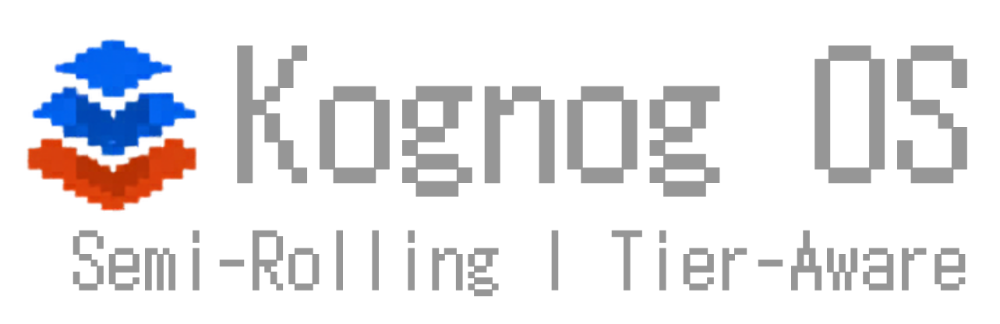

<p align="center">
  
</p>

<p align="center">
  
  
  
  
  
  
  
</p>

> 🛡 **Security** — every release is GPG-signed and every commit is GitHub-Verified. **[Where We Stand](https://github.com/jetomev/KognogOS/blob/main/docs/where-we-stand.md)** explains our response to the 2026 AUR supply-chain attacks, what's current, and how to check us yourself instead of taking our word for it.

> 🧭 **Direction change, 5 October 2026.** KognogOS will ship with **one desktop: [hypeForge](https://github.com/jetomev/forge-suite/tree/main/hypeforge)**, a slim, quick tiling desktop on **Sway**, built from terminal apps first — no KDE Plasma ([hypeForge D-56](https://github.com/jetomev/forge-suite/blob/main/hypeforge/docs/DECISIONS.md)). The **v0.9.0-beta** ISO below was built on Plasma; hypeForge already runs every day on the test desktop. Parts of this page that still describe the Plasma build are marked **†** while they are reworked.

---

## What is KognogOS?

KognogOS is a Linux distribution built on one idea: **not all updates are equal.**

Arch Linux is fast and always current. But it treats every package the same. Your kernel updates on the same schedule as an icon theme — and if a kernel update is broken, your machine doesn't boot.

KognogOS sorts every package into one of three tiers and makes the risky ones wait:

| Tier | What's in it | How long it waits |
|---|---|---|
| **1** | Kernel, bootloader, glibc, systemd, mesa | **30 days** |
| **2** | Desktop, key apps, the Forge Suite | **15 days** |
| **3** | Everything else | **7 days** |

That wait is the whole trick. If an update breaks something, thousands of Arch users hit it first and it gets fixed before it ever reaches you. Your everyday software stays fresh; the parts that can ruin your week don't move until they've been proven.

The rules are enforced by [**nog**](https://github.com/jetomev/nog), our package manager. KognogOS is **nog plus the [Forge Suite](https://github.com/jetomev/forge-suite)** — terminal apps for the jobs that normally mean editing config files and hoping, and for the desktop itself — and comes in **five editions**: Basic, Office, Gaming, Development, and Full.

---

## Philosophy

- **Stable where it counts** — your kernel and core libraries get a 30-day buffer. Everything else stays current.
- **Safe by default** — nog runs pacman underneath, so every install still passes Arch's own signature checks. We add caution, we don't replace the security model.
- **Beautiful on purpose** — hypeForge on Sway (Wayland), Catppuccin Mocha everywhere, one terminal stack chosen and tuned.
- **Slim and quick** — terminal apps first, then what works with Sway, then the smallest install that does the job ([D-57](https://github.com/jetomev/forge-suite/blob/main/hypeforge/docs/DECISIONS.md)).
- **Nothing hidden** — the Forge tools are readable source. No magic, no binaries doing things you can't inspect.
- **Terminal-first** — every KognogOS system tool is a terminal app built on [forgekit](https://github.com/jetomev/forge-suite/tree/main/forgekit), from the welcome screen to the installer. One look and feel from first boot onward.
- **Built to grow** — the architecture leaves room for our own repository and build pipeline later.

---

## Editions

All five editions share the same core — the hypeForge desktop, nog, the Forge Suite, drivers, and the terminal stack. They differ only in the apps layered on top. The definitions live in [`config/profiles.toml`](config/profiles.toml), which the installer reads directly.

**Basic** — the shared core. Boots into hypeForge on Sway with the KognogOS terminal greeting. **†** *The app lists below date from the Plasma build; KDE apps are being replaced by terminal-first ones (galculator for KCalc, the hypeForge screenshot tool for Spectacle…) and each list will be redone.* **Nemo** is the default file manager (Dolphin stays installed), **Fresh Editor** the default text editor, and both **Chrome** and **Brave** are ready. Includes nog, grubForge, and alacrittyForge, plus the everyday floor: Gwenview, Ark, KCalc, Spectacle, full fonts, printing and scanning, and the firewall on by default.

**Office** — adds OnlyOffice, Obsidian, Thunderbird, Xournalpp, Elisa, Spotify, GIMP, Pinta, Kdenlive, Discord, Telegram.

**Gaming** — adds Steam, Lutris, Heroic, Wine, Proton-GE, RetroArch with starter cores (NES, SNES, Genesis, PS1, N64, GBA), 32-bit graphics, Gamescope, GameMode, MangoHud, and OBS Studio.

**Development** — adds VS Code, Neovim, rustup, Node.js, Go, OpenJDK, Docker, Tmux, a modern CLI kit (bat, eza, fd, ripgrep, fzf, zoxide), build tools, and both compiler families with debuggers.

**Full** — everything above.

---

## How the tiers work

Every package belongs to a tier, and nog enforces it.

**Tier 1 — 30 days.** Kernel, bootloader, glibc, systemd, mesa. When the hold expires the update installs normally. If you want even more control, set `manual_signoff = true` in `/etc/nog/tier-pins.toml` and every Tier 1 upgrade will need your explicit approval.

**Tier 2 — 15 days.** The desktop (Sway and hypeForge's pieces), PipeWire, NetworkManager, the Forge Suite.

**Tier 3 — 7 days.** Everything else, which is most of your system.

You can move any package between tiers. Full details in [the nog documentation](https://github.com/jetomev/nog#the-three-tier-system).

**An honest note on what tiers do and don't protect against:** waiting catches *regressions* — updates that shipped broken. It does nothing about a compromised package, because a malicious package is just as malicious 30 days later. That's pacman's signature verification's job, and it still runs on everything.

---

## The Forge Suite

Instead of editing config files by hand and hoping, the Forge tools give you a guided terminal interface with backups and undo. All of them are pinned to Tier 2. Since October 2026 they grow up together in **one repository, [jetomev/forge-suite](https://github.com/jetomev/forge-suite)** — the shipped apps move in one at a time.

| Tool | What it does | Status |
|---|---|---|
| [**nog**](https://github.com/jetomev/nog) | Tier-aware package manager, written in Rust. Sorts every package, enforces the hold windows, and hands off to pacman and your AUR helper. | **v1.8.0** · `yay -S nog` |
| [**grubForge**](https://github.com/jetomev/grubforge) | Edit GRUB safely — boot options, themes, entry order, detecting other operating systems. Backs up before every change. | **Shipping** · `yay -S grubforge` |
| [**alacrittyForge**](https://github.com/jetomev/alacrittyforge) | Configure the Alacritty terminal — fonts, colours, opacity, keybindings — with live previews. | **Shipping** · `yay -S alacrittyforge` |
| [**bitlaForge**](https://github.com/jetomev/bitlaforge) | Solo Bitcoin mining, presented honestly as the lottery it is. | **Shipping** · `yay -S bitlaforge` |
| [**nogForge**](https://github.com/jetomev/nogforge) | Install, update and remove apps through nog, in a window, with the password asked inside the app. Flatpak and Snap next. | **v1.1.1** · `yay -S nogforge` |
| [**hypeForge**](https://github.com/jetomev/forge-suite/tree/main/hypeforge) | The KognogOS desktop on Sway: the menu bar, launcher, workspaces, lock screen, every piece a small applet. | Being built, lived in daily |
| [**displayForge**](https://github.com/jetomev/forge-suite/tree/main/displayforge) | Screen settings: arrange, resolution, refresh rate, size, rotation, brightness — with a countdown that undoes a bad change. | **v1.0.0** · in the Forge Suite |
| [**forgekit**](https://github.com/jetomev/forge-suite/tree/main/forgekit) | The shared foundation every Forge app is built on. | **v0.6.0** · `yay -S python-forgekit` |

---

## Tech Stack

| Component | Choice |
|-----------|--------|
| Base | Arch Linux |
| Kernel | Linux (mainline) + Linux-LTS fallback |
| Microcode | Detected at install (intel-ucode / amd-ucode) |
| Desktop | **hypeForge on Sway** (Wayland) |
| File Manager | **Midnight Commander** in the terminal (our KognogOS skin) · a graphical one **†** to be chosen · **fileForge**, our own, planned |
| Login Screen | **†** to be chosen for Sway (the Plasma build used SDDM with our own greeter) · lock screen: **gtklock** in our look |
| Audio | PipeWire + WirePlumber |
| Network | NetworkManager |
| GPU drivers | Mesa + Vulkan (AMD / Intel) · Nvidia-Open DKMS |
| Package Manager | pacman + **nog** |
| Bootloader Manager | **grubForge** |
| Screens | **displayForge** |
| Terminal | **Alacritty**, configured by alacrittyForge |
| Shell | **Fish** + Tide v6 prompt |
| Default Editor | **Fresh Editor** |
| Browsers | Chrome + Brave (both shipped) |
| Font | JetBrains Mono Nerd Font |
| Theme | Catppuccin Mocha |
| Extra Repos | chaotic-aur |

### Proprietary apps, and what you can swap them for

The installer marks every proprietary app. Uncheck one and it offers a free replacement instead — defined in `config/profiles.toml`.

| Proprietary | Offered instead |
|---|---|
| Google Chrome | Brave (already shipped) · Firefox |
| Spotify | Elisa (already in Office) · Strawberry |
| Discord | Vesktop (open client, same service) · Element (Matrix) |
| Steam | No equivalent exists; Lutris and Heroic stay |
| VS Code (Microsoft build) | VSCodium · `code` (open build) |
| Obsidian | Logseq · Joplin |

---

## Project Structure

```
KognogOS/
|-- assets/wallpapers/     # 10 wallpapers, Arch + Semi variants
|-- config/                # Everything shipped as a system default
|   |-- profiles.toml      #   the five editions
|   |-- tier-pins.toml     #   which packages are Tier 1 and Tier 2
|   |-- pacman.conf        #   core/extra/multilib/chaotic-aur
|   |-- alacritty.toml, config.fish, tide_config.fish
|-- docs/                  # Changelog, security article, project records
|-- iso/                   # archiso profile — the live ISO build tree
|-- logo/                  # KognogOS emblem
|-- scripts/               # ISO build, desktop capture (Plasma era †), theming, audits
|-- skel/                  # New-user home directory defaults
|-- LICENSE
|-- README.md
```

Two directories are planned but empty for now: `installer/` (see [issue #2](https://github.com/jetomev/KognogOS/issues/2)) and a future package repository.

---

## Where the project stands

KognogOS is in **early development**, aiming at a **v1.0 public ISO in April 2027** — the project's anniversary week, two years after the wish that started it ("create an installer of my arch linux setup", 19 April 2025).

**Working today:**

- **nog v1.8.0**, stable on the AUR — tier-aware updates across pacman, the AUR, Flatpak, and Snap
- **The Forge Suite** — grubForge, alacrittyForge, bitlaForge and nogForge on the AUR, with forgekit as the shared foundation; displayForge 1.0 in the [Forge Suite repository](https://github.com/jetomev/forge-suite)
- **hypeForge**, the desktop on Sway, used every day on the test desktop
- **Five editions** defined in `config/profiles.toml`
- **The terminal stack** — Alacritty, Fish, Tide v6, and the KognogOS greeting with a tier-aware update status
- **A branded boot** — GRUB, Plymouth and the shell greeting drawn from one emblem and palette (the Plasma splash and SDDM greeter **†** belong to the Plasma build)
- **chaotic-aur enabled from the start**, governed by the tier system like any other repo. It ships with **65 Tier 1 pins** — kernels, mesa and nvidia builds, ZFS modules, boot-entry writers — generated by `scripts/chaotic-tier-audit.py` and refreshed each release. Everything else in chaotic rides Tier 3's 7-day hold.

**The first release** will be KognogOS **Semi** — the tier-aware flagship — with all five editions selectable at install time. The installer is **installForge**, a Forge-style terminal installer that reads `config/profiles.toml`.

It installs **online**: every package comes from the mirrors during installation. That means the ISO carries no redistributable payload at all, and proprietary apps are simply downloaded with your consent like anything else, never shipped inside the image. You'll need a network connection to install.

---

## One ISO a year

KognogOS releases once a year, on purpose. This is a two-person project — one human, one AI — and this is the honest way to run it:

- **All year**, work goes into nog and the Forge Suite. Every improvement reaches existing installs immediately through normal updates. This is still a semi-rolling Arch system; the ISO is an installer snapshot, not a feature gate.
- **Once a year**, that work becomes a new ISO.
- **Feedback** has one door: [GitHub Issues](https://github.com/jetomev/KognogOS/issues). Findings batch into the next annual ISO. The only exception is a critical installer or security bug, which gets a respin.
- **The horizon** is three to five years, and that's fine. By the time it's done, the Forge library will be deep and the distro will be genuinely fun.

---

## Roadmap

The road to v1.0, targeting **April 2027**.

- [x] **Phase 1 — Capture the desktop** ✅ *done 30 July 2026* — a repeatable script that captures a live Plasma configuration into the new-user defaults, stripping personal traces by rule. Validated over four test rounds.
- [x] **Phase 2 — First bootable ISO** ✅ *v0.9.0-beta, 31 July 2026* — a live Plasma session with our branding, terminal stack, and nog plus the Forge suite preinstalled.
- [ ] **Phase 2b — the hypeForge ISO** — the same, with hypeForge on Sway as the only desktop (D-56): the desktop is being finished on the test machine first, then the disc recipe is rebuilt around it. Includes choosing the login screen for Sway.
- [ ] **Phase 3 — installForge** — the terminal installer, in its own repo like its siblings. Edition picker, guided disk setup, user creation. Proprietary apps are marked and swappable during selection. The Development edition additionally suggests reviewing the tier pins against your toolchain.
  - **With thanks to Omarchy's installer.** On 28 September 2026 Javier installed [Omarchy](https://github.com/basecamp/omarchy) 4.0.4 in a VM while starting [hypeForge](https://github.com/jetomev/forge-suite/tree/main/hypeforge). His words: *"I love the Omarchy install, fits our installForge idea."* Ideas we are grateful to learn from, in its [manual](https://github.com/basecamp/omarchy/blob/quattro/manual/02-getting-started.md) and [release notes](https://github.com/basecamp/omarchy/releases/tag/v4.0.0):
    - the choice between taking a whole disk and using free space next to another system, for dual booting
    - disk encryption on by default, with a documented way to skip it
    - a mode that prepares the computer for a new owner and leaves the personal questions for their first boot
    - bootable snapshots you pick from the boot menu
    - installs that take about a minute
  - installForge installs **online**, as described above. We don't compare ourselves with anyone; our picks are simply our picks.
- [ ] **welcomeforge** — the Welcome Center, and forgekit's pilot app. Opens at session start. On the live ISO it leads with **Install**; once installed it drops that and adds a "show at startup" toggle. Covers the project and its philosophy, a guided nog tour, the Forge suite, the tier guide, and where to give feedback.
- [ ] **Tier reference guide** — a plain-language manual: what each tier means, how to read and edit `tier-pins.toml`, and worked examples.
- [ ] **Phase 4 — Testing** — virtual machines first, then the real test: wipe a physical machine and install it from the ISO alone, repeating until a run has zero deviations.
- [ ] **Phase 5 — Release kit** — ISO hosting, checksums and signatures, and the project site.
- [ ] **Phase 6 — v1.0** — GitHub release, project page, announcements, and a DistroWatch submission. Their queue takes months; an annual cadence shrugs.

**Deliberately deferred:**

- A graphical installer — after installForge proves the flow
- Our own package repository — not needed while the official repos and the AUR carry everything
- The "Arch" brand variant — a future year
- ~~nogForge~~ — shipped (v1.1.1)

---

## Changelog

### Unreleased — Boot-to-prompt identity

KognogOS now looks like itself from the power button to the shell. Before this, a machine booted through generic GRUB text, showed a third-party splash, and stopped at a stock login screen before finally reaching a KognogOS desktop.

- 🥾 **The whole boot chain is ours** — a GRUB theme with a generated background, Plymouth on startup *and* shutdown, and the Plasma splash moved into its own package instead of overwriting somebody else's theme in place
- 🔐 **Our own SDDM login screen** — black field, borderless card, the tier emblem down the left edge, fully keyboard-navigable. Power buttons grey out rather than disappearing when unavailable. Written in plain QtQuick only, because a missing module in a login screen means a black screen with no way in.
- ⏱ **The greeting got fast** — it used to run an update check on *every* terminal launch, costing about 1.2 seconds of network each time and much more on a slow mirror. A background timer now refreshes a snapshot and the greeting just reads it.
- 🚦 **Update status in the greeting** — green, yellow, or red, where red means a Tier 1 or Tier 2 package *you are running* is more than twice its hold window old. Deliberately not "how new is the newest build available", because a well-maintained package is always a few days behind and that would never mean anything.

**Bugs we found on the way, and what they taught us:**

- The greeting's tier notifications had **never once fired**. A too-greedy text substitution reduced every package name to a bare comma, so both lists were always empty — 167 pending updates produced silence.
- A polish script **duplicated the entire boot menu**, because it wrote its backup *inside* the GRUB config directory while preserving the executable bit — and GRUB runs every executable file in there. The backup ran as a second menu generator.
- CPU usage read 100%, because the idle column was being counted as busy.
- Memory and disk disagreed with `free` and `df` — they measure and round differently than we assumed.

**Still open:** `installer/` is still empty on this branch ([issue #2](https://github.com/jetomev/KognogOS/issues/2)). The Plasma lock screen question ([issue #3](https://github.com/jetomev/KognogOS/issues/3)) closed with the move to hypeForge, whose lock screen is already ours.

### v0.9.0-beta — 31 July 2026

**The first bootable KognogOS.** Phases 1 and 2 landed in one 48-hour sprint. A branded, Full-edition live ISO builds reproducibly and boots to a complete desktop.

- 🥾 **A bootable ISO** — boot menu, quiet boot into our Plymouth theme, matching splash for continuity into the desktop, about 4 GB compressed
- 🖥 **The captured desktop, validated** — rule-driven sanitizing, launcher filtering, and a 20-marker self-check, proven across test rounds
- 🧭 **The identity heals itself** — a pacman hook restores our system identity after any update that would overwrite it, so the system never quietly reverts to calling itself Arch
- 🗂 **Product surface locked** — five editions curated, online-install ruling, the proprietary swap table, and the full terminal suite
- 🛡 **Tier system hardened** — chaotic-aur ruled active with generated pins, an official-repo sweep (125 Tier 1, 44 Tier 2), and three parallel audits of the dependency chains
- 🔎 **Lessons burned into the scripts** — a silent build cache, a compression bug that corrupted images, and how Plasma actually stores wallpapers

*The full history lives in [docs/CHANGELOG.md](docs/CHANGELOG.md).*

---

## Related Projects

The KognogOS ecosystem spans several repositories, all built by the same two:

- **[nog](https://github.com/jetomev/nog)** — the tier-aware package manager. The engine that makes KognogOS semi-rolling.
- **[Forge Suite](https://github.com/jetomev/forge-suite)** — the Forge apps in one repository: **hypeForge** (the desktop), **displayForge** (screens) and **forgekit** (the shared foundation), with more moving in.
- **[grubForge](https://github.com/jetomev/grubforge)** — GRUB bootloader manager.
- **[alacrittyForge](https://github.com/jetomev/alacrittyforge)** — Alacritty terminal configurator.
- **[bitlaForge](https://github.com/jetomev/bitlaforge)** — solo Bitcoin mining, honestly framed.
- **[nogForge](https://github.com/jetomev/nogforge)** — packages through nog, in a window.
- **[mindForge](https://github.com/jetomev/mindforge)** — the working agreement between the human and the AI.

---

## Authors

**jetomev** — idea, vision, direction, testing

**Claude (Anthropic)** — co-developer, architecture, implementation

KognogOS is a collaboration between a human with a clear idea of what a Linux distribution should feel like, and an AI that helped design and build it — one `config/profiles.toml` entry at a time.

---

## License

KognogOS is free software, released under the **GNU General Public License v3.0**. See [LICENSE](LICENSE) for the full text.

---

## Contributing

KognogOS is in early alpha. Ideas, feedback, and contributions are welcome — open an issue or a pull request.

If the project resonates with you, a star helps others find it.
